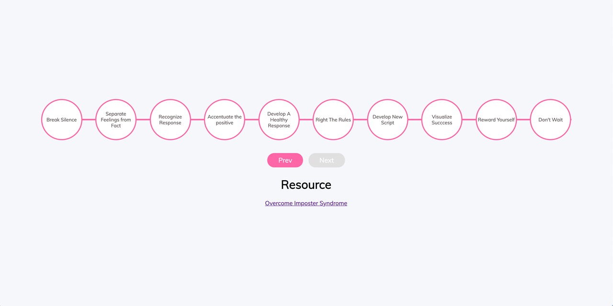

<p id="header"><p>

<table><tr>
<td> <a href="https://github.com/emjose/color-flipper/#header"></a> </td>
<td> <a href="https://github.com/emjose/one-hundred/#header"></a> </td>
<td> <a href="https://github.com/emjose/expand-search-one/#header"></a> </td>
</tr></table>

<br>

<p id="project-title"><p>

<a href=#table-of-contents></a> 

<br>

<a href="https://emjose.github.io/progress-bar"></a> 

#

<p id="table-of-contents"><p>

<a href=#table-of-contents></a>  

- [100 Days of Code](#100days)
- [Installation](#installation) 
- [Live Site](#live-site)
- [Resources](#resources)
- [Let's Connect!](#lets-connect) 

#

<p id="100days"><p>

<a href=#100days></a>  

### Day 3: February 4, 2021
- For Day 3, I turned a tutorial for a progress bar into 10 steps for overcoming imposter syndrome.

- The 10 steps are from this <a href="https://impostorsyndrome.com/10-steps-overcome-impostor/">article</a> by <a href="https://impostorsyndrome.com/valerie-young/">Dr. Valerie Young</a>.

- In the future, I plan to make this project responsive.

#

<p id="installation"><p>

<a href=#installation></a>

#### Git clone and cd into the repo folder:
``` 
git clone git@github.com:emjose/progress-bar.git && cd progress-bar 
```
#### Run the command:
```
open index.html
```

#

<p id="live-site"><p>

<a href="https://emjose.github.io/progress-bar"></a>  

<a href="https://emjose.github.io/progress-bar"></a>

#

<p id="resources"><p>

<a href=#resources></a>  

- #### [What is Imposter Syndrome?](https://www.verywellmind.com/imposter-syndrome-and-social-anxiety-disorder-4156469)

- #### [50 Projects in 50 Days Udemy Course](https://www.udemy.com/course/50-projects-50-days/)

- #### [Step Progress Bar Tutorial](https://youtu.be/qKjDXXkkg8I) by [Web Dev](https://www.youtube.com/channel/UCwjGnSW_aIzuqxCmwPWggNA)

- #### [10 Steps You can Use to Overcome Imposter Syndrome](https://impostorsyndrome.com/10-steps-overcome-impostor/) by [Dr. Valerie Young](https://impostorsyndrome.com/valerie-young/)

- #### [My blog on how I created my Github READMEs](https://emmanueljose.medium.com/readme-a-makeover-story-b9c7be37a6de?sk=7ae6623d365409d875753e4604e42ffd) 

#

<p id="lets-connect"><p>

<a href=#lets-connect></a>

<p><a href="https://twitter.com/Emmanuel_Labor"> <a href="https://www.linkedin.com/in/emmanuelpjose/"> <a href="https://emmanueljose.medium.com/"> <a href="https://www.instagram.com/emmanuel_jose/"> <a href="mailto:emjose@gmail.com"> <a href="https://www.youtube.com/channel/UCQdqFg-_J83jn9xJRd1W3tQ/videos"> <a href="https://github.com/emjose"></p>

#

<a href=#header></a>